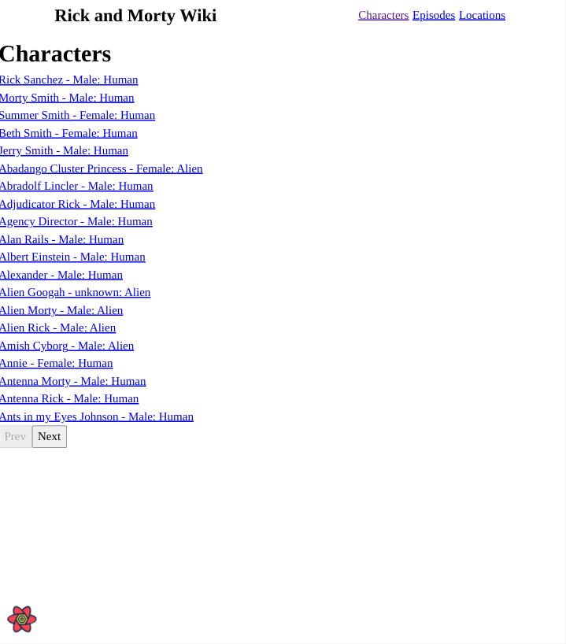
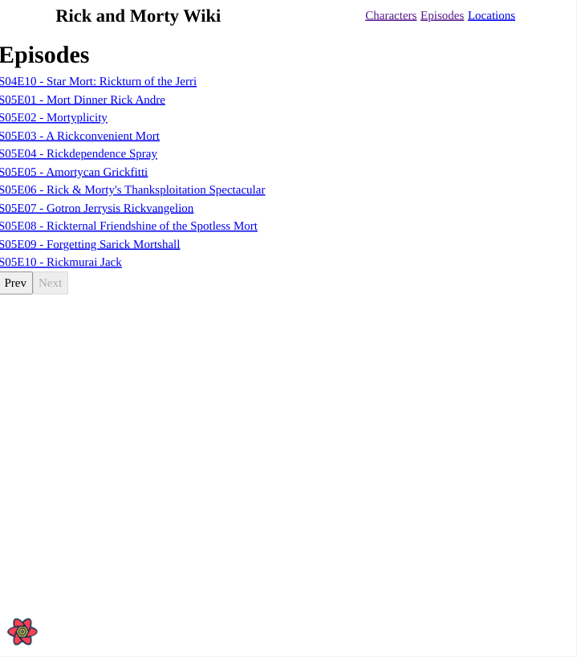
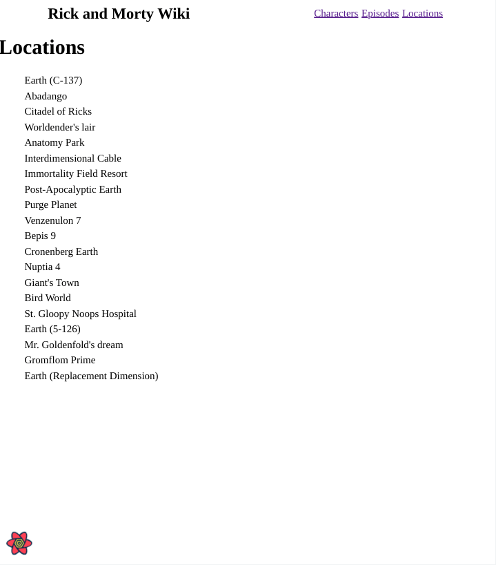

# Rick and Morty Wiki

Simple project to reinforce what I learned about React Query.  Similar to [Futurama-Wiki Project](https://github.com/jdegand/futurama-fan-wiki).    

## Table of contents

- [Overview](#overview)
  - [Screenshot](#screenshot)
- [My process](#my-process)
  - [Built with](#built-with)
  - [What I learned](#what-i-learned)
  - [Useful resources](#useful-resources)

## Overview

### Screenshot

## My process

### Built with

- [React](https://reactjs.org/)
- [React Query](https://react-query.tanstack.com/)
- [React Router](https://reactrouter.com/)
- [Rick and Morty Api](https://rickandmortyapi.com/)

### What I learned

- I started this without noticing that the React Query documentation has an example using the Rick and Morty api.  
- The documentation's [example](https://react-query.tanstack.com/examples/rick-morty) is slightly outdated and has duplicated logic.  
- I have looked into dependent queries and parallel queries etc to explore better ways of doing it.  

- I usually prefer fetch vs installing another package.  So it is important to remember to throw errors when using fetch.  Error handling is always glossed over and it is easy to assume fetch will throw an error.  Have to throw the error inside the fetcher function.  

- useParams will return undefined if your route parameter name is different - it must match whatever name you gave it in the route

- Easy to intermix React Router 5 and React Router 6 patterns and create a jumble.  The idea of using a layout is something that I am still not used to implementating.  It is reminiscent of express templates.  

- usePaginatedQuery() is deprecated.  

- Putting the page state at the top level prevents the list from resetting to the first 20 results when you use the back arrow.
- However, I didn't add the page to the url so you can't bookmark a specific part of the list.  

- For the characters it is inconvenient but the episode list is much shorter.  
- Search for a character would be a nice addition.  

- Rick and Morty Api really doesn't give much information about show - no synopsis of episodes, voice actor, relationship to other characters, etc. 

- Location is confusing - I originally thought that the location was the last place a character had been but I now think it refers to a location specific to that character
- The api does have a lot of shortcut properties

- I may or may not style this - the api really provides nothing to work with
- I though about using bootstrap to add simple cards but there is no description of a character or episode to put in the main body. 

### Useful resources

- [Stack Overflow](https://stackoverflow.com/questions/66797655/filtering-a-fetched-list-from-an-api-using-react-query) - filtering a fetched list 
- [React Query Docs](https://react-query.tanstack.com/guides/query-functions#usage-with-fetch-and-others-clients-that-do-not-throw-by-default) - react query and fetch
- [YouTube](https://www.youtube.com/watch?v=NQULKpW6hK4) - React Query Crash Course - Basic Implementation
- [YouTube](https://www.youtube.com/watch?v=aLQbVd-2tIo) - React Query Overview
- [Dev.to](https://dev.to/siddharthvenkatesh/cleaner-data-fetching-with-react-query-4klg) - react query 
- [Blog](https://tkdodo.eu/blog/practical-react-query) - react query in depth
- [Stack Overflow](https://stackoverflow.com/questions/66506891/useparams-hook-returns-undefined-in-react-functional-component) - useParams mismatch
- [Stack Overflow](https://stackoverflow.com/questions/29552601/how-to-set-the-defaultroute-to-another-route-in-react-router) - redirect on default route 
- [Stack Exchange](https://webmasters.stackexchange.com/questions/6923/should-menu-titles-h1-h2-h3-be-inside-or-outside-the-nav-tag) - menu titles inside nav tag
- [Stack Overflow](https://stackoverflow.com/questions/51604671/reactjs-how-can-i-implement-pagination-for-react-with-keep-state-when-route-ch) - react router and pagination
- [YouTube](https://www.youtube.com/watch?v=rAuEmI1Fat8) - coding pagination
- [Learn with Param](https://learnwithparam.com/blog/dynamic-pages-in-react-router/) - react router
- [YouTube](https://www.youtube.com/watch?v=XBRLVRjZ3CQ) - react router v6
- [Stack Overflow](https://stackoverflow.com/questions/30915173/react-router-go-back-a-page-how-do-you-configure-history) - configure history in react router
- [Stack Overflow](https://stackoverflow.com/questions/60260704/how-to-fetch-n-dependent-data-with-react-query) - dependent queries